# 旅行体验分享平台ER图

## 1. 用户信息实体图 (图4.1)

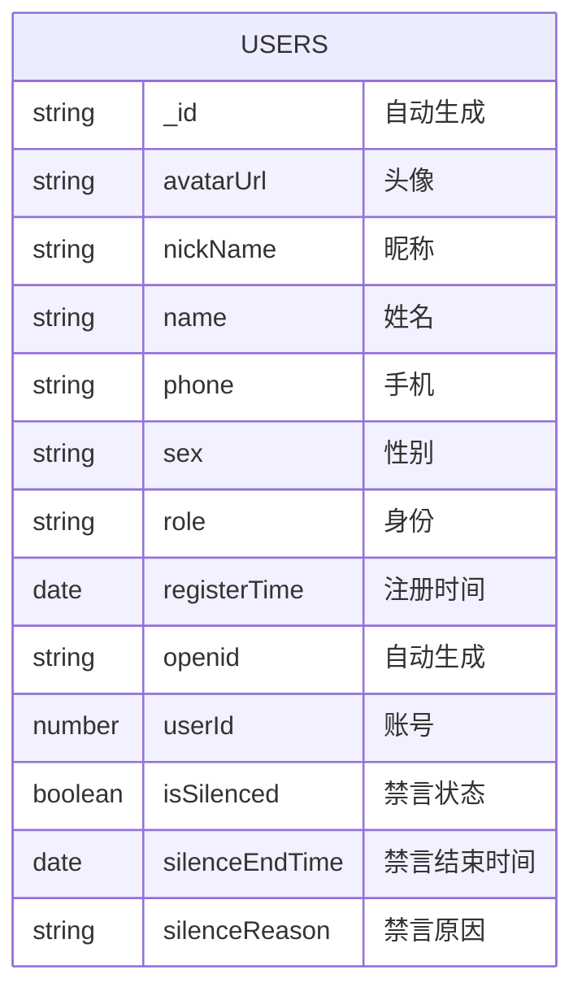

## 2. 帖子信息实体图 (图4.2)

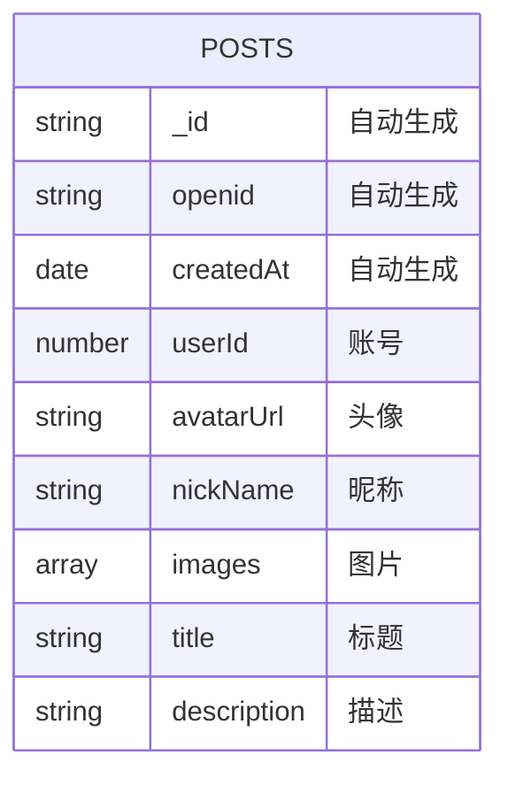

## 3. 商品信息实体图 (图4.3)

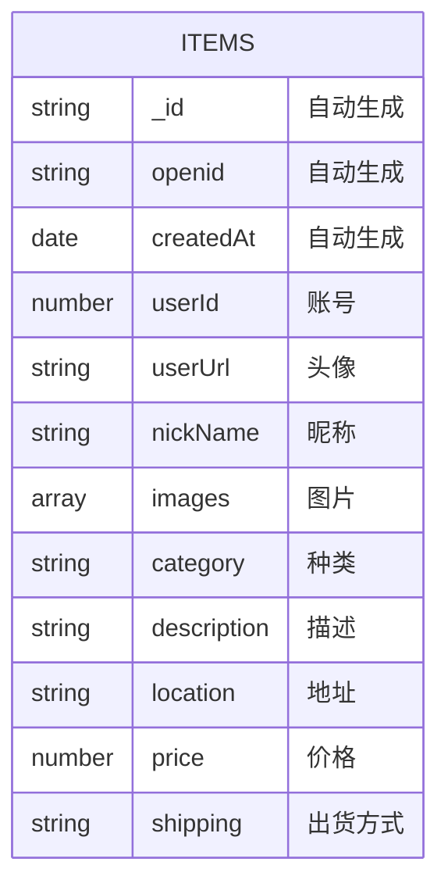

## 4. 评论信息实体图 (图4.4)

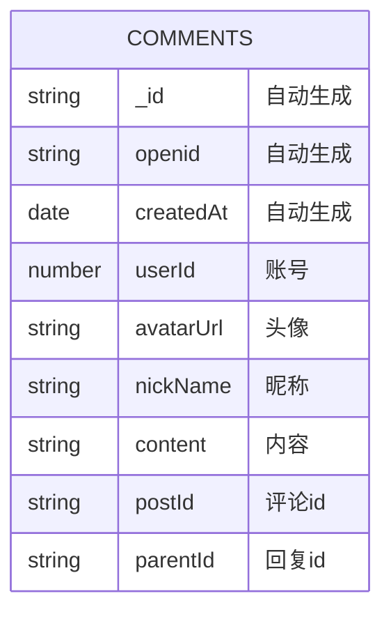

## 5. 权限申请实体图 (图4.5)

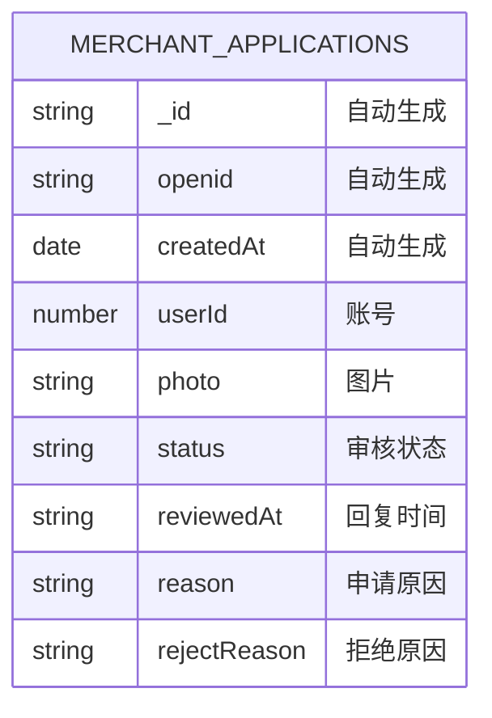

## 6. 景区信息实体图 (图4.6)

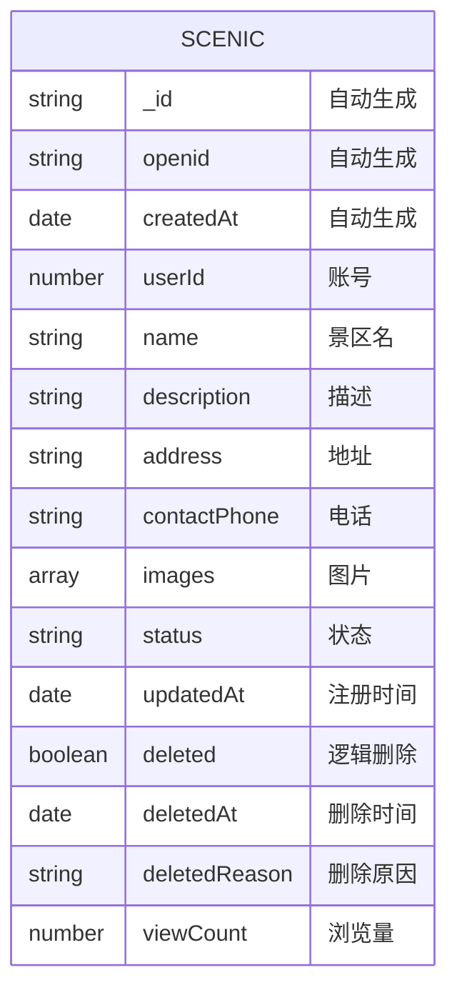

## 7. 门票信息实体图 (图4.7)

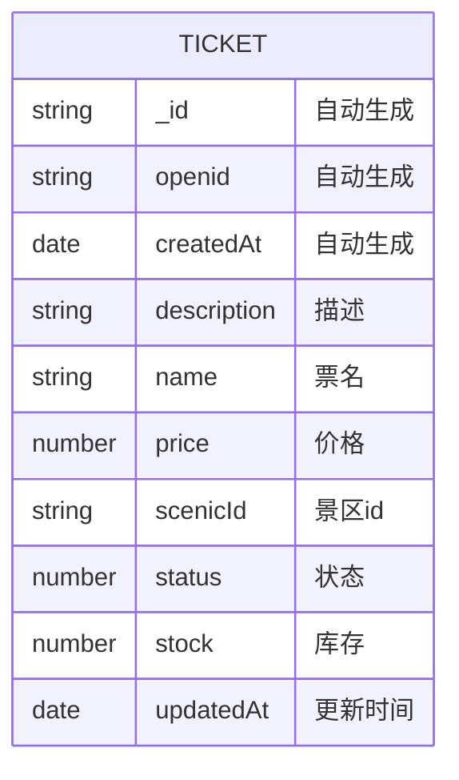

## 8. 优惠信息实体图 (图4.8)

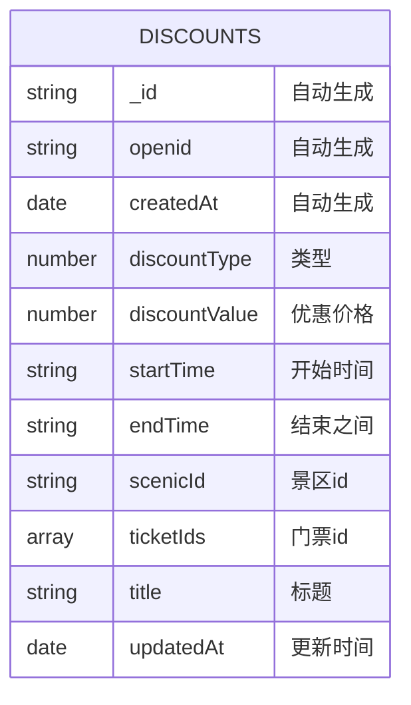

## 9. 轮播图信息实体图 (图4.9)

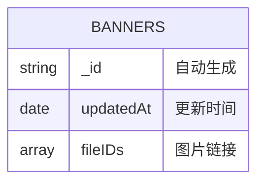

## 10. 计数器信息实体图 (图4.10)

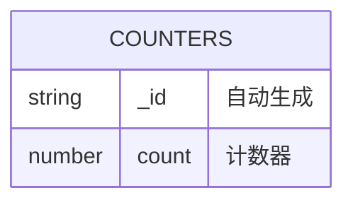

## 11. 点赞信息实体图 (图4.11)

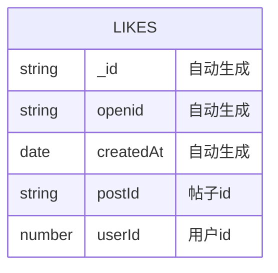

## 12. 门票销售信息实体图 (图4.12)

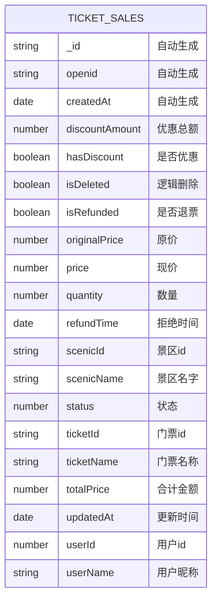

## 实体关系图

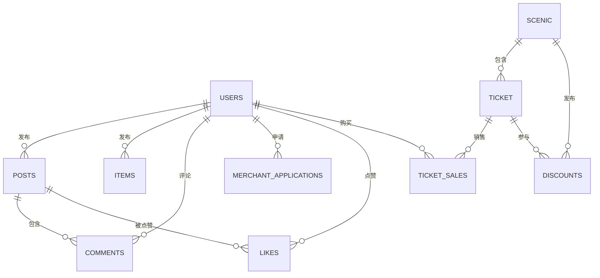